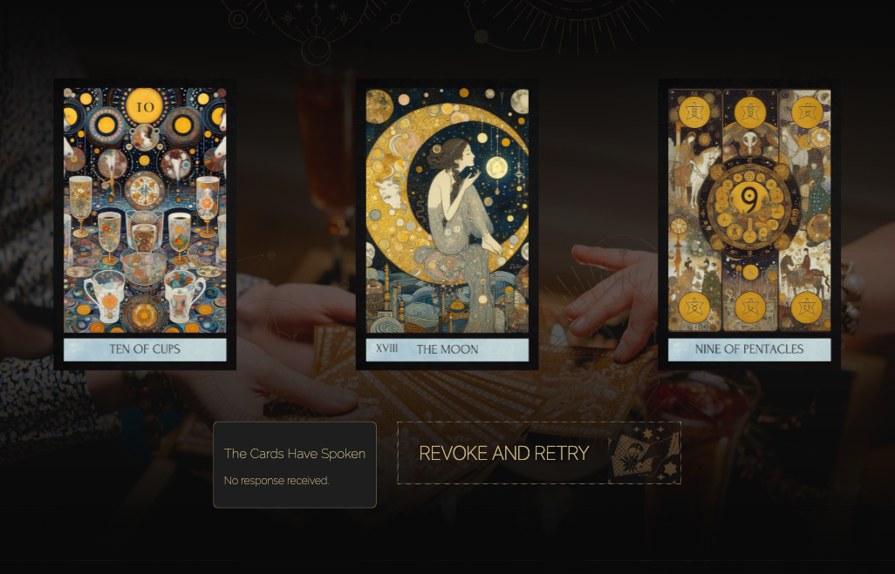
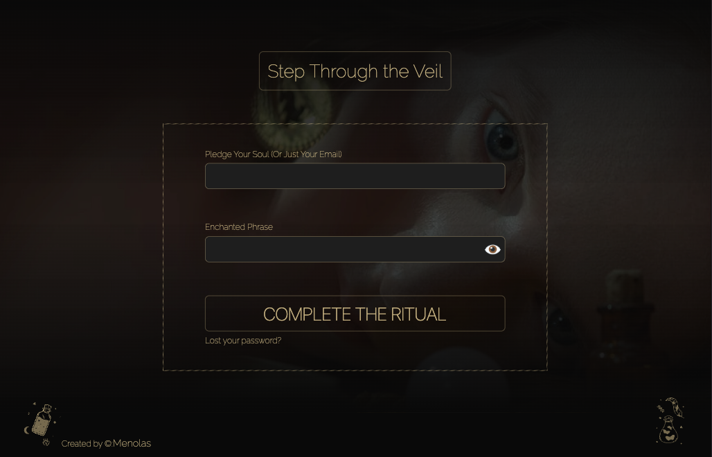

# Tarot — Magic Light

An interactive tarot card reading web app with a richly themed mystical UI. Users can shuffle the deck, draw cards in a 3-card spread, browse the full card gallery, and create an account to save their readings.

🔗 **Live Demo:** [tarot-next-app.vercel.app](https://tarot-next-app.vercel.app)

## Tech Stack

| Layer | Technology |
|-------|------------|
| Framework | Next.js |
| Language | TypeScript |
| Styling | SCSS |
| Deployment | Vercel |

## Features

- **Deck Shuffle** — animated card shuffling interaction
- **3-Card Spread** — draw and reveal tarot cards with meanings
- **Card Gallery** — browse the full deck with detailed card illustrations
- **Authentication** — user registration and login with password recovery
- **Responsive Design** — optimized for desktop and mobile
- **Themed UI** — custom dark/gold mystical aesthetic with illustrated card art

## Screenshots





## Getting Started

### Prerequisites

- Node.js (v18+)
- npm

### Installation

```bash
git clone https://github.com/Menolas/tarot-next-app.git
cd tarot-next-app
npm install
```

### Running Locally

```bash
npm run dev
```

Open [http://localhost:3000](http://localhost:3000) in your browser.

## Project Structure

```
tarot-next-app/
├── public/          # Static assets (card images, fonts, etc.)
├── src/             # Application source code
├── next.config.mjs  # Next.js configuration
├── tsconfig.json    # TypeScript configuration
└── package.json
```

## Screenshots

<!-- Add screenshots here -->
<!--  -->
<!--  -->
